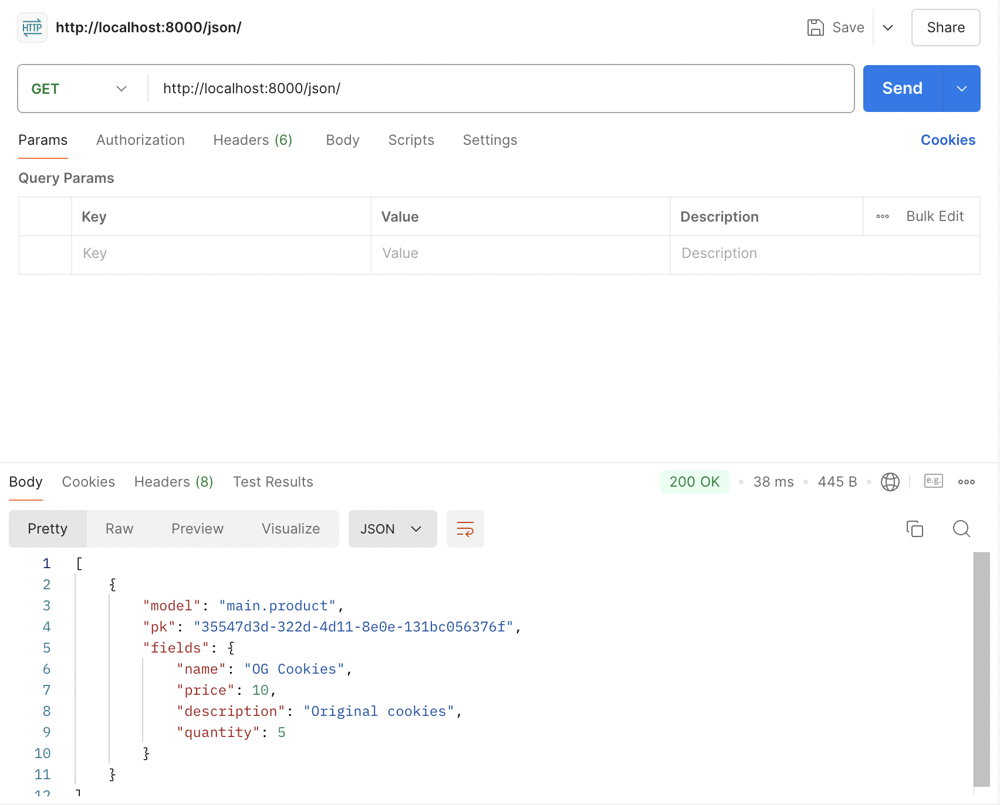

## Assignment 2

**Questions and Answers**
1. Explain how you implemented the checklist above step-by-step (not just following the tutorial).

- Create a new directory with the name ```crumbitez```
- Open the terminal and create a virtual environment by running the command 
```
python3 -m venv env
```
- Activate the virtual environment with the command
```
source env/bin/activate
```
- Inside the same directory, create a new file named ```requirements.txt``` and fill it with some dependencies
```
django
gunicorn
whitenoise
psycopg2-binary
requests
urllib3
```
- Install the dependencies with the command
```
pip install -r requirements.txt
```
- Create a Django project named ```crumbitez``` with the command
```
django-admin startproject crumbitez .
```
- In the settings.py, add the following line of code to the ALLOWED_HOSTS
```
...
ALLOWED_HOSTS = ["localhost", "127.0.0.1"]
...
```
- Create an application called main with command
```
python manage.py startapp main
```
- After the app main installed, added main to the INSTALLED_APPS in the file settings.py
```
INSTALLED_APPS = [
    ...,
    'main'
]
```
- Create a new directory named templates inside the main application. Inside the templates directory, create a new file named main.html and fill it with
```
<h1>{{ app_name }} </h1>
<h5>Name: </h5>
<p>{{ name }}</p>
<h5>Class: </h5>
<p>{{ class }}</p>
```
- Open the models.py file in the main application directory and fill it with this code
```
from django.db import models

class Product(models.Model):
    name = models.CharField(max_length=100)
    price = models.IntegerField()
    description = models.TextField()
    quantity = models.IntegerField()
```
- Open the views.py file located in the main application file and fill it with
```
def show_main(request):
    context = {
        'app_name': 'crumbitez',
        'name': 'Syifa Ananda Widyati',
        'class': 'PBD KKI'
    }

    return render(request, 'main.html', context)
```
- Open the ```urls.py``` file in the main directory and fill it with the code
```
from django.urls import path
from main.views import show_main

app_name = 'main'

urlpatterns = [
    path('', show_main, name='show_main'),
]
```
- Open the urls.py file inside of the crumbitez project and fill it with code
```
from django.contrib import admin
from django.urls import path, include

urlpatterns = [
    path('admin/', admin.site.urls),
    path('', include('main.urls')),
]
```
Git and PWS deployment
- Made a new repository in github and connect it with my local repository
- After connected, do a add, commit, and push
- For deployment, create a PWS project named crumbitez. Then add ```syifa-ananda.31.pbp.cs.ui.ac.id``` to ALLOWED_HOSTS in setting.py
```
ALLOWED_HOSTS = ["localhost", "127.0.0.1", "syifa-ananda31-crumbitez.pbp.cs.ui.ac.id"]
```
- Push to PWS repository for the deployment

2. Create a diagram that contains the request client to a Django-based web application and the response it gives, and explain the relationship between urls.py, views.py, models.py, and the html file.


3. Explain the use of git in software development!

Git is a tool in software development that helps manage code changes and enables collaboration among developers on project versions and features or fixes branches before integrating them into the main codebase repository effectively maintaining a record of alterations, for easy rollback when necessary. 

4. In your opinion, out of all the frameworks available, why is Django used as the starting point for learning software development?

Django is often chosen as a starting point for learning software development because it's a high-level, beginner-friendly web framework that encourages clean, organized code and follows best practices like the DRY (Don't Repeat Yourself) principle. It comes with built-in features like authentication, database management, and an admin panel, allowing learners to focus on creating applications rather than starting form scratch each time. Its strong documentation and active community support also make it an ideal choice for beginners.

5. Why is the Django model called an ORM?

Django models are called an ORM (Object-Relational Mapping) because they allow developers to work with databases using Python objects than directly writing SQL queries form scratch. The ORM automatically translates Python code (like creating, reading, updating, or deleting data) into SQL commands that are executed on the database. This abstraction simplifies database operations and ensures that developers work with database records as if they were Python objects, making development more intuitive.


## Assignment 3

**Question and Answers**
1. Explain why we need data delivery in implementing a platform.

Data delivery is essential for implementing a platform as it enables real-time access to information, facilitating prompt decision-making and seamless platform operations. It enables scalability as data volumes increase and facilitates smooth integration of different data sources, such as APIs or IoT devices, improving the overall user experience. Reliable data delivery reduces delays and ensuring consistent performance. This is crucial for platforms handling high traffic or needing real-time processing.

2. In your opinion, which is better, XML or JSON? Why is JSON more popular than XML?

In my opinion, JSON is better than XML for most modern applications due to its simplicity, lightweight structure, and native support in JavaScript, making it easier to use and more efficient for data transmission. JSON's popularity is driven by its readability, smaller file sizes, and quicker parsing in web development, whereas XML is more verbose and complex, making it less suitable for contemporary web-based systems.
 
3. Explain the functional usage of is_valid() method in Django forms. Also explain why we need the method in forms.

In Django forms, is_valid() method is used to validate the data submitted in a form according to the validations defined by the form. When the form is triggered, it prepares every field in the form to be validated against whatever criteria you have (like required fields, type of fields and custom validators). True means the data is valid in which case form.SetValue method validated returns true and gives us the form with validated data. cleaned_data. Otherwise it returns False and you can access the errors in form.errors. This method is important to ensure that only valid and clean data is processed or saved, which helps to maintain data integrity and prevent errors in application logic.

4. Why do we need csrf_token when creating a form in Django? What could happen if we did not use csrf_token on a Django form? How could this be leveraged by an attacker?

The csrf_token in Django forms is used to protect against Cross-Site Request Forgery (CSRF) attacks, in which a malicious request is submitted without the user's awareness due to trickery by an attacker. This token guarantees that the form was submitted from the same site and not externally. If the csrf_token is not used, a fake form that submitted requests on behalf of the user might be placed on some other site which could enable unauthorized actions such as changing account details, transferring funds or deleting data. Without the CSRF protection, these types of attacks could compromise the security and integrity of the web application.
 
5. Explain how you implemented the checklist above step-by-step

**Create a form input to add a model object to the previous app**

- Create a new file in the main directory with the name ```forms.py``` to create the structure of the form and fill it with
```
from django.forms import ModelForm
from main.models import Product

class CrumbitezEntryForm(ModelForm):
    class Meta:
        model = Product
        fields = ["name", "price", "description", "quantity"]
```
- Open the ```views.py``` file in the main directory. Add ```from django.shortcuts import render, redirect``` and create the function with the name ```create_product```
```
def create_product(request):
    form = CrumbitezEntryForm(request.POST or None)

    if form.is_valid() and request.method == "POST":
        form.save()
        return redirect('main:show_main')

    context = {'form': form}
    return render(request, "create_product.html", context)
```
- Change the ```show_main``` function that already exists in the ```views.py``` file to the following
```
def show_main(request):
    crumbitez_entries = Product.objects.all()

    context = {
        'app_name': 'crumbitez',
        'name': 'Syifa Ananda Widyati',
        'class': 'PBD KKI',
        'product_entries': 'crumbitez_entries',
    }

    return render(request, 'main.html', context)
```
- Open the ```urls.py``` file and import the ```create_product``` function and add the URL path to the ```urlpatterns``` varaible
```
from main.views import show_main, create_product
```
```
urlpatterns = [
   ...
   path('create-product', create_product, name='create_product'),
]
```
- Create new HTML file named  ```create_product.html``` in the ```main/templates``` and add the following code
```
 

<h1>Add New Product</h1>

<form method="POST">
  
  <table>
    {{ form.as_table }}
    <tr>
      <td></td>
      <td>
        <input type="submit" value="Add Product" />
      </td>
    </tr>
  </table>
</form>


```

**Add 4 views to view the added objects in XML, JSON, XML by ID, and JSON by ID formats**

- Open the ```views.py``` file and add the ```HttpResponse``` and ```Serializer``` imports at the top of the file
```
from django.http import HttpResponse
from django.core import serializers
```
- Create four new function in the ```views.py```
```
def show_xml(request):
    data = Product.objects.all()
    return HttpResponse(serializers.serialize("xml", data), content_type="application/xml")

def show_json(request):
    data = Product.objects.all()
    return HttpResponse(serializers.serialize("json", data), content_type="application/json")

def show_xml_by_id(request, id):
    data = Product.objects.filter(pk=id)
    return HttpResponse(serializers.serialize("xml", data), content_type="application/xml")

def show_json_by_id(request, id):
    data = Product.objects.filter(pk=id)
    return HttpResponse(serializers.serialize("json", data), content_type="application/json")
```

**Create URL routing for each of the views**

- Open the ```urls.py``` file and import the function that we just created
```
from main.views import show_main, create_product, show_xml, show_json, show_xml_by_id, show_json_by_id
```
- Add the URL path to the ```urlpatterns``` variable in the ```urls.py``` file to access the function that was imported in the previous point
```
...
path('xml/', show_xml, name='show_xml'),
path('json/', show_json, name='show_json'),
path('xml/<str:id>/', show_xml_by_id, name='show_xml_by_id'),
path('json/<str:id>/', show_json_by_id, name='show_json_by_id'),
```

**Postman Result**

- XML


- XML by ID


- JSON


- JSON by ID


## Assignment 4

**Steps**

**Implement the register, login, and logout functions**
- Open views.py, add imports and register function
```
from django.contrib.auth.forms import UserCreationForm
from django.contrib import messages
```
```
def register(request):
    form = UserCreationForm()

    if request.method == "POST":
        form = UserCreationForm(request.POST)
        if form.is_valid():
            form.save()
            messages.success(request, 'Your account has been successfully created!')
            return redirect('main:login')
    context = {'form':form}
    return render(request, 'register.html', context)
```
- Create a new HTML file named ```register.html``` in the ```main/templates``` directory and add this code
```
 
<title>Register</title>
 

<div class="login">
  <h1>Register</h1>

  <form method="POST">
    
    <table>
      {{ form.as_table }}
      <tr>
        <td></td>
        <td><input type="submit" name="submit" value="Register" /></td>
      </tr>
    </table>
  </form>

  
  <ul>
    
    <li>{{ message }}</li>
    
  </ul>
  
</div>


```
- Open ```urls.py```, import the register function and add a URL path to ```urlpatterns``` to access the imported function
```
from main.views import register
```
```
 urlpatterns = [
     ...
     path('register/', register, name='register'),
 ]
 ```
- Reopen ```views.py```, add the imports, login_user function, and logout_user function
```
from django.contrib.auth.forms import UserCreationForm, AuthenticationForm
from django.contrib.auth import authenticate, login
from django.contrib.auth import logout
```
```
def login_user(request):
   if request.method == 'POST':
      form = AuthenticationForm(data=request.POST)

      if form.is_valid():
            user = form.get_user()
            login(request, user)
            return redirect('main:show_main')

   else:
      form = AuthenticationForm(request)
   context = {'form': form}
   return render(request, 'login.html', context)
```
```
def logout_user(request):
    logout(request)
    return redirect('main:login')
```
- Create a new HTML files named ```login.html``` and add this code
```



<title>Login</title>



<div class="login">
  <h1>Login</h1>

  <form method="POST" action="">
    
    <table>
      {{ form.as_table }}
      <tr>
        <td></td>
        <td><input class="btn login_btn" type="submit" value="Login" /></td>
      </tr>
    </table>
  </form>

  
  <ul>
    
    <li>{{ message }}</li>
    
  </ul>
   Don't have an account yet?
  <a href="">Register Now</a>
</div>


```
- Open ```main.html``` file in the ```main/templates``` directory and add the following code snippet after the hyperlink tag for "Add New Product"
```
...
<a href="">
  <button>Logout</button>
</a>
...
```
- Open ```urls.py```, import the functions and add the URL path to ```urlpatterns```
```
from main.views import login_user
from main.views import logout_user
```
```
urlpatterns = [
   ...
   path('login/', login_user, name='login'),
   path('logout/', logout_user, name='logout'),
]
```

** Connects models Product and User**
- Open models.py and add the following code below the line that imports the model
```
from django.contrib.auth.models import User
```
- Add this code inside the class ```Product```
```
user = models.ForeignKey(User, on_delete=models.CASCADE)
```
- Open ```views.py``` and modify the code in the ```create_product``` function
```
def create_product(request):
    form = CrumbitezEntryForm(request.POST or None)

    if form.is_valid() and request.method == "POST":
        crumbitez_entry = form.save(commit=False)
        crumbitez_entry.user = request.user
        crumbitez_entry.save()
        return redirect('main:show_main')

    context = {'form': form}
    return render(request, "create_product.html", context)
```

**Display logged in user details such as username and apply cookies like last login to the application's main page**
- In the ```show_main``` function, add the following snippet to the context variable 
```
'last_login': request.COOKIES['last_login']
```
- Open the ```main.html``` file and add the following snippet after the logout button to display the last login data.
```
...
<h5>Last login session: {{ last_login }}</h5>
...
```
- - Change the value of ```crumbirez_entries``` and context in the function ```show_main``` as follows
```
def show_main(request):
    crumbitez_entries = Product.objects.filter(user=request.user)

    context = {
        'name': request.user.username,
...
```

**Qusetions and Answers**
1. What is the difference between HttpResponseRedirect() and redirect()?

`HttpResponseRedirect()` is a lower-level function that requires a full URL to redirect the user. In contrast, `redirect()` is a higher-level Django shortcut that can take a URL, view name, or model instance and internally uses `HttpResponseRedirect`, making it more flexible and easier to use.

2. Explain how the MoodEntry model is linked with User!

The `MoodEntry` model in Django is connected to the `User` model through a foreign key relationship, enabling each mood entry to be linked to a particular user. This is done using `models.ForeignKey(User, on_delete=models.CASCADE)`. Each `MoodEntry` is linked to a single `User`, and when the user is removed, their related mood entries are also removed. This relationship helps in tracking the creator of each mood entry and ensures that the data is organized by user accounts.

3. What is the difference between authentication and authorization, and what happens when a user logs in? Explain how Django implements these two concepts.

Authentication validates a user's identity. It is involves confirming a user's identity through methods such as a username and password. On the other hand, authorization specifies the resources or actions that an authenticated user is permitted to access. 

Django initially authenticates a user by verifying the provided credentials against the database, typically using the `authenticate()` and `login()` functions, once the user logs in. If the credentials are valid, Django sets a session, linking the user to a session ID stored in cookies, allowing them to stay logged in across requests. 

Django handles authentication with the User model and its authentication system (authenticate(), login(), logout()), while authorization is controlled through permissions and groups. Permissions can be assigned to users or groups. Views can be restricted based on these permissions using Django's built-in decorators, such as `@login_required` and `@permission_required`.

4. How does Django remember logged-in users? Explain other uses of cookies and whether all cookies are safe to use.

Django remembers logged-in users by using sessions. It stores a session ID in the user's browser as a cookie. When a user logs in, Django assigns a session ID and stores it in a cookie on the client side. The session data, such as the user's identity, is securely stored on the server. Whenever a user sends a request, their browser automatically sends the session cookie. This enables Django to recognize the user without requiring them to authenticate again. Besides sessions, cookies are utilized for additional functionalities such as tracking user preferences, managing shopping carts, and analytics. Not all cookies are safe, especially if they store sensitive data or are vulnerable to cross-site scripting (XSS) attacks. To guarantee safety, cookies should be carefully managed with flags such as `Secure` (to restrict transmission to HTTPS only) and `HttpOnly` (to block access through JavaScript).


## Assignment 5

**Steps**

**Adding Tailwind to the application**
- Import tailwind in ```base.html```
```<head>

    <meta charset="UTF-8" />
    <meta name="viewport" content="width=device-width, initial-scale=1">

<script src="https://cdn.tailwindcss.com">
</script>
</head>
```

**Addding edit and delete Features**
- Create new function named ```edit_product``` and ```delete_product``` in ```views.py```
```
def edit_product(request, id):
    data = Product.objects.get(pk = id)
    form = CrumbitezEntryForm(request.POST or None, instance=data)

    if form.is_valid() and request.method == "POST":
        form.save()
        return HttpResponseRedirect(reverse('main:show_main'))

    context = {'form': form}
    return render(request, "edit_product.html", context)

def delete_product(request, id):
    data = Product.objects.get(pk = id)
    data.delete()
    return HttpResponseRedirect(reverse('main:show_main'))
```
- Add imports to ```views.py```
```
from django.urls import reverse
from django.http import HttpResponse, HttpResponseRedirect
```
- Create a new HTML file name ```edit_product.html``` in the ```main/templates``` and fill in with this code
```



<title>Edit Product</title>




<div class="flex flex-col min-h-screen bg-[#f5f5dc]"> <!-- Light beige background for the entire page -->
  <div class="container mx-auto px-4 py-8 mt-16 max-w-xl">
    <h1 class="text-3xl font-bold text-center mb-8 text-[#8b4513]">Edit Product Entry</h1> <!-- Dark brown title -->
  
    <!-- White background for the form container with rounded corners and a border -->
    <div class="bg-white shadow-md rounded-lg p-6 form-style">
      <form method="POST" class="space-y-6">
          
          
              <div class="flex flex-col">
                  <label for="{{ field.id_for_label }}" class="mb-2 font-semibold text-[#5c4033]"> <!-- Medium brown for labels -->
                      {{ field.label }}
                  </label>
                  <div class="w-full">
                      <!-- Add visible borders to input fields only -->
                      {{ field|safe }} <!-- This ensures that the field is rendered correctly -->
                      <style>
                        /* Style input fields, textareas, and select elements */
                        input, select, textarea {
                          border: 2px solid #8b4513; /* Dark brown border */
                          background-color: white; /* Keep input background white */
                          padding: 8px; /* Add some padding for the fields */
                          border-radius: 4px; /* Slightly rounded corners */
                          width: 100%; /* Full width for fields */
                          box-sizing: border-box; /* Include padding in width calculation */
                        }
                        input:focus, select:focus, textarea:focus {
                          outline: none; /* Remove default outline */
                          border-color: #8b4513; /* Keep dark brown border on focus */
                          box-shadow: 0 0 4px #8b4513; /* Add subtle shadow on focus */
                        }
                      </style>
                  </div>
                  
                      <p class="mt-1 text-sm text-[#8b572a]">{{ field.help_text }}</p> <!-- Light brown for help text -->
                  
                  
                      <p class="mt-1 text-sm text-red-600">{{ error }}</p>
                  
              </div>
          
          <div class="flex justify-center mt-6">
              <button type="submit" class="bg-[#8b4513] text-white font-semibold px-6 py-3 rounded-lg hover:bg-[#5c4033] transition duration-300 ease-in-out w-full"> <!-- Dark brown button -->
                  Edit Product Entry
              </button>
          </div>
      </form>
  </div>
  </div>
</div>

```
- Add imports to ```urls.py``` and add a URL to ```urlpatterns```
```
from main.views import edit_product
from main.views import delete_product
```
```
 path('edit-product/<uuid:id>/', edit_product, name='edit_product'),
 path('delete/<uuid:id>', delete_product, name='delete_product'),
```
- Modify the ```main.html``` to add edit and delete button 
```
...
<tr>
    ...
    <td>
        <a href="">
            <button>
                Edit
            </button>
        </a>
    </td>
    <td>
        <a href="">
            <button>
                Delete
            </button>
        </a>
    </td>
</tr>
...
```

**Adding Navigation Bar**
- Create new HTML file named ```navbar.html``` and fill in with this code
```
<nav class="bg-[#8B4513] shadow-lg fixed top-0 left-0 z-40 w-full">
  <div class="max-w-7xl mx-auto px-4 sm:px-6 lg:px-8">
    <div class="flex items-center justify-between h-16">
      <!-- Logo/Title and Home Link Section -->
      <div class="flex items-center space-x-4">
        <h1 class="text-2xl font-bold text-center text-white">Crumbitez</h1>
        <!-- Home Link -->
        <a href="" class="text-white hover:text-gray-300">Home</a>
      </div>

      <!-- Authentication Links Section (Hidden on Mobile) -->
      <div class="hidden md:flex items-center space-x-4">
        
          <span class="text-gray-200 mr-4">Welcome, {{ user.username }}</span>
          <a href="" class="text-center bg-red-500 hover:bg-red-600 text-white font-bold py-2 px-4 rounded transition duration-300">
            Logout
          </a>
        
          <a href="" class="text-center bg-blue-500 hover:bg-blue-600 text-white font-bold py-2 px-4 rounded transition duration-300 mr-2">
            Login
          </a>
          <a href="" class="text-center bg-green-500 hover:bg-green-600 text-white font-bold py-2 px-4 rounded transition duration-300">
            Register
          </a>
        
      </div>

      <!-- Mobile Menu Button -->
      <div class="md:hidden flex items-center">
        <button class="mobile-menu-button">
          <svg class="w-6 h-6 text-white" fill="none" stroke-linecap="round" stroke-linejoin="round" stroke-width="2" viewBox="0 0 24 24" stroke="currentColor">
            <path d="M4 6h16M4 12h16M4 18h16"></path>
          </svg>
        </button>
      </div>
    </div>
  </div>

  <!-- Mobile Menu -->
  <div class="mobile-menu hidden md:hidden px-4 w-full md:max-w-full bg-[#8B4513] text-white">
    <div class="pt-2 pb-3 space-y-1">
      <!-- Home Link for Mobile -->
      <a href="" class="block px-3 py-2 rounded-md text-base font-medium hover:bg-[#5c4033]">Home</a>
      
        <span class="block text-gray-200 px-3 py-2">Welcome, {{ user.username }}</span>
        <a href="" class="block text-center bg-red-500 hover:bg-red-600 text-white font-bold py-2 px-4 rounded transition duration-300">
          Logout
        </a>
      
        <a href="" class="block text-center bg-blue-500 hover:bg-blue-600 text-white font-bold py-2 px-4 rounded transition duration-300 mb-2">
          Login
        </a>
        <a href="" class="block text-center bg-green-500 hover:bg-green-600 text-white font-bold py-2 px-4 rounded transition duration-300">
          Register
        </a>
      
    </div>
  </div>

  <!-- Mobile Menu Toggle Script -->
  <script>
    // Ensure the DOM is fully loaded before executing the script
    document.addEventListener('DOMContentLoaded', function () {
      // Select the mobile menu button and menu container
      const btn = document.querySelector(".mobile-menu-button");
      const menu = document.querySelector(".mobile-menu");

      // Add a click event listener to the button
      btn.addEventListener("click", function () {
        menu.classList.toggle("hidden"); // Toggle the 'hidden' class to show/hide the menu
      });
    });
  </script>
</nav>
```

**Configuring Static Files**
- In ```settings.py```, add this
```
...
MIDDLEWARE = [
    'django.middleware.security.SecurityMiddleware',
    'whitenoise.middleware.WhiteNoiseMiddleware', # Add it directly under SecurityMiddleware
    ...
]
...
```
```
...
STATIC_URL = '/static/'
if DEBUG:
    STATICFILES_DIRS = [
        BASE_DIR / 'static' # refers to /static root project in development mode
    ]
else:
    STATIC_ROOT = BASE_DIR / 'static' # refers to /static root project in production mode
...
```
- Add ```global.css``` to ```base.html```
```

<!DOCTYPE html>
<html lang="en">
  <head>
    <meta charset="UTF-8" />
    <meta name="viewport" content="width=device-width, initial-scale=1.0" />
     
    <script src="https://cdn.tailwindcss.com"></script>
    <link rel="stylesheet" href=""/>
  </head>
  <body>
     
  </body>
</html>
```
- Adding custom styling to ```global.css```
```
.form-style form input, form textarea, form select {
    width: 100%;
    padding: 0.5rem;
    border: 2px solid #bcbcbc;
    border-radius: 0.375rem;
}
.form-style form input:focus, form textarea:focus, form select:focus {
    outline: none;
    border-color: #674ea7;
    box-shadow: 0 0 0 3px #674ea7;
}
@keyframes shine {
    0% { background-position: -200% 0; }
    100% { background-position: 200% 0; }
}
.animate-shine {
    background: linear-gradient(120deg, rgba(255, 255, 255, 0.3), rgba(255, 255, 255, 0.1) 50%, rgba(255, 255, 255, 0.3));
    background-size: 200% 100%;
    animation: shine 3s infinite;
}
```

**Styling the login, register, and add product pages**
- ```login.html```
```



<title>Login</title>



<div class="min-h-screen flex items-center justify-center w-screen bg-beige-200 py-12 px-4 sm:px-6 lg:px-8" style="background-color: #f5f5dc;"> <!-- Light beige background -->
  <div class="max-w-md w-full space-y-8 p-8 bg-white rounded-lg shadow-md">
    <div class="text-center">
      <h2 class="mt-6 text-center text-black text-3xl font-extrabold">
        Login to your account
      </h2>
    </div>
    <form class="mt-8 space-y-6" method="POST" action="">
      
      <input type="hidden" name="remember" value="true">
      <div class="rounded-md shadow-sm -space-y-px">
        <div>
          <label for="username" class="sr-only">Username</label>
          <input id="username" name="username" type="text" required class="appearance-none rounded-none relative block w-full px-3 py-2 border border-gray-300 placeholder-gray-500 text-gray-900 rounded-t-md focus:outline-none focus:ring-yellow-500 focus:border-yellow-500 focus:z-10 sm:text-sm" placeholder="Username">
        </div>
        <div>
          <label for="password" class="sr-only">Password</label>
          <input id="password" name="password" type="password" required class="appearance-none rounded-none relative block w-full px-3 py-2 border border-gray-300 placeholder-gray-500 text-gray-900 rounded-b-md focus:outline-none focus:ring-yellow-500 focus:border-yellow-500 focus:z-10 sm:text-sm" placeholder="Password">
        </div>
      </div>

      <div>
        <button type="submit" class="group relative w-full flex justify-center py-2 px-4 border border-transparent text-sm font-medium rounded-md text-white bg-brown-600 hover:bg-brown-700 focus:outline-none focus:ring-2 focus:ring-offset-2 focus:ring-yellow-500" style="background-color: #8B4513;">
          Sign in
        </button>   
      </div>
    </form>

    
    <div class="mt-4">
      
      
            <div class="bg-green-100 border border-green-400 text-green-700 px-4 py-3 rounded relative" role="alert">
                <span class="block sm:inline">{{ message }}</span>
            </div>
        
            <div class="bg-red-100 border border-red-400 text-red-700 px-4 py-3 rounded relative" role="alert">
                <span class="block sm:inline">{{ message }}</span>
            </div>
        
            <div class="bg-blue-100 border border-blue-400 text-blue-700 px-4 py-3 rounded relative" role="alert">
                <span class="block sm:inline">{{ message }}</span>
            </div>
        
      
    </div>
    

    <div class="text-center mt-4">
      <p class="text-sm text-black">
        Don't have an account yet?
        <a href="" class="font-medium text-yellow-600 hover:text-yellow-800">
          Register Now
        </a>
      </p>
    </div>
  </div>
</div>

```

- ```register.html```
```



<title>Register</title>



<div class="min-h-screen flex items-center justify-center bg-[#f5f5dc] py-12 px-4 sm:px-6 lg:px-8"> <!-- Light beige background -->
  <div class="max-w-md w-full space-y-8 p-8 bg-white rounded-lg shadow-md">
    <div>
      <h2 class="mt-6 text-center text-3xl font-extrabold text-black">
        Create your account
      </h2>
    </div>
    <form class="mt-8 space-y-6" method="POST">
      
      <input type="hidden" name="remember" value="true">
      <div class="rounded-md shadow-sm -space-y-px">
        
          <div class="mt-4">
            <label for="{{ field.id_for_label }}" class="mb-2 font-semibold text-black">
              {{ field.label }}
            </label>
            <div class="relative">
              <!-- Update each field to include border styles -->
              {{ field|safe }}
              <style>
                /* Add styles to input, select, and textarea elements */
                input, select, textarea {
                  border: 2px solid #8B4513; /* Dark brown border */
                  padding: 10px; /* Padding inside input fields */
                  border-radius: 6px; /* Slightly rounded corners */
                  background-color: white; /* Keep the input fields' background color white */
                  width: 100%; /* Make input fields take full width */
                  box-sizing: border-box; /* Ensure padding is included in width calculation */
                }
                input:focus, select:focus, textarea:focus {
                  border-color: #8B4513; /* Dark brown border on focus */
                  outline: none; /* Remove default outline */
                  box-shadow: 0 0 4px #8B4513; /* Subtle shadow on focus */
                }
              </style>
              <div class="absolute inset-y-0 right-0 pr-3 flex items-center pointer-events-none">
                
                  <svg class="h-5 w-5 text-red-500" fill="currentColor" viewBox="0 0 20 20">
                    <path fill-rule="evenodd" d="M18 10a8 8 0 11-16 0 8 8 0 0116 0zm-7 4a1 1 0 11-2 0 1 1 0 012 0zm-1-9a1 1 0 00-1 1v4a1 1 0 102 0V6a1 1 0 00-1-1z" clip-rule="evenodd" />
                  </svg>
                
              </div>
            </div>
            
              
                <p class="mt-1 text-sm text-red-600">{{ error }}</p>
              
            
          </div>
        
      </div>

      <div>
        <button type="submit" class="group relative w-full flex justify-center py-2 px-4 border border-transparent text-sm font-medium rounded-md text-white bg-[#8B4513] hover:bg-[#5c4033] focus:outline-none focus:ring-2 focus:ring-offset-2 focus:ring-yellow-500"> <!-- Dark brown button -->
          Register
        </button>
      </div>
    </form>

    
    <div class="mt-4">
      
      <div class="bg-red-100 border border-red-400 text-red-700 px-4 py-3 rounded relative" role="alert">
        <span class="block sm:inline">{{ message }}</span>
      </div>
      
    </div>
    

    <div class="text-center mt-4">
      <p class="text-sm text-black">
        Already have an account?
        <a href="" class="font-medium text-yellow-600 hover:text-yellow-800">
          Login here
        </a>
      </p>
    </div>
  </div>
</div>

```
- ```card_info.html```
```
<div class="bg-[#fffaf0] rounded-xl overflow-hidden border-2 border-[#d2b48c] shadow-lg"> <!-- Light cream background with tan border for contrast -->
  <div class="p-4">
      <h5 class="text-lg font-semibold text-[#8b4513]"> <!-- Darker brown title -->
        {{ title }}
      </h5>
      <p class="text-[#5c4033]"> <!-- Medium brown text for value -->
        {{ value }}
      </p>
  </div>
</div>
```
- ```card_product.html```
```
<div class="relative break-inside-avoid">
  <div class="absolute top-2 z-10 left-1/2 -translate-x-1/2 flex items-center -space-x-2">
    <div class="w-[3rem] h-8 bg-[#f5f5dc] rounded-md opacity-80 -rotate-90"></div> <!-- Light beige for decorative rectangles -->
    <div class="w-[3rem] h-8 bg-[#f5f5dc] rounded-md opacity-80 -rotate-90"></div>
  </div>
  <div class="relative top-5 bg-[#fff5e3] shadow-md rounded-lg mb-6 break-inside-avoid flex flex-col border-2 border-[#8b4513] transform rotate-1 hover:rotate-0 transition-transform duration-300"> <!-- Cookie-like cream background with dark brown border -->
    <div class="bg-[#f5e6ca] text-[#5c4033] p-4 rounded-t-lg border-b-2 border-[#8b4513]"> <!-- Light beige background and brown text -->
      <h3 class="font-bold text-xl mb-2">{{ product_entry.name }}</h3>
      <p class="text-[#8b572a]">{{ product_entry.time }}</p> <!-- Lighter brown for timestamp -->
    </div>
    <div class="p-4">
      <p class="font-semibold text-lg mb-2 text-[#8b4513]">Description</p> <!-- Dark brown for description header -->
      <p class="text-[#5c4033] mb-2">
        <span class="bg-[linear-gradient(to_bottom,transparent_0%,transparent_calc(100%_-_1px),#f5f5dc_calc(100%_-_1px))] bg-[length:100%_1.5rem] pb-1">{{ product_entry.description }}</span> <!-- Gradient background resembling cookie color -->
      </p>
      <div class="mt-4">
        <p class="text-[#8b4513] font-semibold mb-2">Price</p>
        <p class="text-[#5c4033] mb-2">{{ product_entry.price }}</p>

        <p class="text-[#8b4513] font-semibold mb-2">Quantity</p>
        <p class="text-[#5c4033]">{{ product_entry.quantity }}</p>
      </div>
    </div>
  </div>
  <div class="absolute top-0 -right-4 flex space-x-1">
    <a href="" class="bg-[#d2691e] hover:bg-[#b25d1c] text-white rounded-full p-2 transition duration-300 shadow-md"> <!-- Darker orange-brown edit button -->
      <svg xmlns="http://www.w3.org/2000/svg" class="h-9 w-9" viewBox="0 0 20 20" fill="currentColor">
        <path d="M13.586 3.586a2 2 0 112.828 2.828l-.793.793-2.828-2.828.793-.793zM11.379 5.793L3 14.172V17h2.828l8.38-8.379-2.83-2.828z" />
      </svg>
    </a>
    <a href="" class="bg-[#b22222] hover:bg-[#8b1a1a] text-white rounded-full p-2 transition duration-300 shadow-md"> <!-- Red delete button -->
      <svg xmlns="http://www.w3.org/2000/svg" class="h-9 w-9" viewBox="0 0 20 20" fill="currentColor">
        <path fill-rule="evenodd" d="M9 2a1 1 0 00-.894.553L7.382 4H4a1 1 0 000 2v10a2 2 0 002 2h8a2 2 0 002-2V6a1 1 0 100-2h-3.382l-.724-1.447A1 1 0 0011 2H9zM7 8a1 1 0 012 0v6a1 1 0 11-2 0V8zm5-1a1 1 0 00-1 1v6a1 1 0 102 0V8a1 1 0 00-1-1z" clip-rule="evenodd" />
      </svg>
    </a>
  </div>
</div>
```
- ```create_product.html```
```



<title>Create Product</title>





<div class="flex flex-col min-h-screen bg-[#f5f5dc]"> <!-- Light beige background for the entire page -->
  <div class="container mx-auto px-4 py-8 mt-16 max-w-xl">
    <h1 class="text-3xl font-bold text-center mb-8 text-[#8b4513]">Create Product Entry</h1> <!-- Dark brown title -->
  
    <!-- White background for the form container with rounded corners and a border -->
    <div class="bg-white shadow-md rounded-lg p-6 form-style">
      <form method="POST" class="space-y-6">
        
        
          <div class="flex flex-col">
            <label for="{{ field.id_for_label }}" class="mb-2 font-semibold text-[#5c4033]"> <!-- Medium brown for labels -->
              {{ field.label }}
            </label>
            <div class="w-full">
              <!-- Add visible borders to input fields only -->
              {{ field|safe }} <!-- This ensures that the field is rendered correctly -->
              <style>
                /* Style input fields, textareas, and select elements */
                input, select, textarea {
                  border: 2px solid #8b4513; /* Dark brown border */
                  background-color: white; /* Keep input background white */
                  padding: 8px; /* Add some padding for the fields */
                  border-radius: 4px; /* Slightly rounded corners */
                  width: 100%; /* Full width for fields */
                  box-sizing: border-box; /* Include padding in width calculation */
                }
                input:focus, select:focus, textarea:focus {
                  outline: none; /* Remove default outline */
                  border-color: #8b4513; /* Keep dark brown border on focus */
                  box-shadow: 0 0 4px #8b4513; /* Add subtle shadow on focus */
                }
              </style>
            </div>
            
              <p class="mt-1 text-sm text-[#8b572a]">{{ field.help_text }}</p> <!-- Light brown for help text -->
            
            
              <p class="mt-1 text-sm text-red-600">{{ error }}</p>
            
          </div>
        
        <div class="flex justify-center mt-6">
          <button type="submit" class="bg-[#8b4513] text-white font-semibold px-6 py-3 rounded-lg hover:bg-[#5c4033] transition duration-300 ease-in-out w-full"> <!-- Dark brown button -->
            Create Product Entry
          </button>
        </div>
      </form>
    </div>
  </div>
</div>


```
- ```edit_product.html```
```



<title>Edit Product</title>




<div class="flex flex-col min-h-screen bg-[#f5f5dc]"> <!-- Light beige background for the entire page -->
  <div class="container mx-auto px-4 py-8 mt-16 max-w-xl">
    <h1 class="text-3xl font-bold text-center mb-8 text-[#8b4513]">Edit Product Entry</h1> <!-- Dark brown title -->
  
    <!-- White background for the form container with rounded corners and a border -->
    <div class="bg-white shadow-md rounded-lg p-6 form-style">
      <form method="POST" class="space-y-6">
          
          
              <div class="flex flex-col">
                  <label for="{{ field.id_for_label }}" class="mb-2 font-semibold text-[#5c4033]"> <!-- Medium brown for labels -->
                      {{ field.label }}
                  </label>
                  <div class="w-full">
                      <!-- Add visible borders to input fields only -->
                      {{ field|safe }} <!-- This ensures that the field is rendered correctly -->
                      <style>
                        /* Style input fields, textareas, and select elements */
                        input, select, textarea {
                          border: 2px solid #8b4513; /* Dark brown border */
                          background-color: white; /* Keep input background white */
                          padding: 8px; /* Add some padding for the fields */
                          border-radius: 4px; /* Slightly rounded corners */
                          width: 100%; /* Full width for fields */
                          box-sizing: border-box; /* Include padding in width calculation */
                        }
                        input:focus, select:focus, textarea:focus {
                          outline: none; /* Remove default outline */
                          border-color: #8b4513; /* Keep dark brown border on focus */
                          box-shadow: 0 0 4px #8b4513; /* Add subtle shadow on focus */
                        }
                      </style>
                  </div>
                  
                      <p class="mt-1 text-sm text-[#8b572a]">{{ field.help_text }}</p> <!-- Light brown for help text -->
                  
                  
                      <p class="mt-1 text-sm text-red-600">{{ error }}</p>
                  
              </div>
          
          <div class="flex justify-center mt-6">
              <button type="submit" class="bg-[#8b4513] text-white font-semibold px-6 py-3 rounded-lg hover:bg-[#5c4033] transition duration-300 ease-in-out w-full"> <!-- Dark brown button -->
                  Edit Product Entry
              </button>
          </div>
      </form>
  </div>
  </div>
</div>

```

- modify the ```main.html```
```




<title>Crumbitez</title>



<div class="overflow-x-hidden px-4 md:px-8 pb-8 pt-24 min-h-screen bg-[#f5f5dc] flex flex-col"> <!-- Light beige background -->
  <div class="p-2 mb-6 relative">
    <div class="relative grid grid-cols-1 z-30 md:grid-cols-3 gap-8">
      
      
      
    </div>
    <div class="w-full px-6 absolute top-[44px] left-0 z-20 hidden md:flex">
      <div class="w-full min-h-4 bg-[#8b4513]"> <!-- Dark brown separator bar -->
      </div>
    </div>
    <div class="h-full w-full py-6 absolute top-0 left-0 z-20 md:hidden flex">
      <div class="h-full min-w-4 bg-[#8b4513] mx-auto"> <!-- Dark brown vertical line -->
      </div>
    </div>
</div>
    <div class="px-3 mb-4">
      <div class="flex rounded-md items-center bg-[#8b4513] py-2 px-4 w-fit"> <!-- Dark brown last login box -->
        <h1 class="text-white text-center">Last Login: {{last_login}}</h1>
      </div>
    </div>
    <div class="flex justify-end mb-6">
        <a href="" class="bg-[#8b4513] hover:bg-[#5c4033] text-white font-bold py-2 px-4 rounded-lg transition duration-300 ease-in-out transform hover:-translate-y-1 hover:scale-105"> <!-- Dark brown button for adding products -->
            Add New Product 
        </a>
    </div>
    
    
    <div class="flex flex-col items-center justify-center min-h-[24rem] p-6">
        
        <p class="text-center text-[#5c4033] mt-4">There is no product data in mental health tracker.</p> <!-- Medium brown text -->
    </div>
    
    <div class="columns-1 sm:columns-2 lg:columns-3 gap-6 space-y-6 w-full">
        
            
        
    </div>
    
</div>

```


**Questions and Answers**
1. If there are multiple CSS selectors for an HTML element, explain the priority order of these CSS selectors!

CSS specificity is like a ranking system that the browser uses to determine which styles should take precedence when there are conflicting rules. The priority of CSS selectors is evaluated based on four criteria:

- Inline styles: These are the highest priority because they are written directly in the HTML element, using the style attribute. For example, <div style="color: red;"> will always override any other external or internal CSS rules.

- IDs: An ID selector (e.g., #header) has a higher priority than class selectors or element selectors. ID selectors are unique to each page and are considered more specific.

- Classes, attributes, and pseudo-classes: These come next in priority. A class selector (.menu), attribute selector ([type="text"]), or pseudo-class selector (:hover) will override element selectors if they target the same element.

- Element selectors and pseudo-elements: These have the lowest priority. For instance, targeting an element like p or h1 will be overridden by any class, ID, or inline style applied to the same element.

2. Why does responsive design become an important concept in web application development? Give examples of applications that have and have not implemented responsive design!

Responsive design is all about making sure a website or app looks and works great no matter what device you’re using—whether it’s a phone, tablet, or desktop. With so many people browsing the web on different screen sizes, it’s important for websites to adjust and stay user friendly on all of them. For example, platforms like Twitter and Amazon do this really well. They rearrange their content and menus depending on our screen size, making it easy to use whether we're on our phone or laptop. But sites without responsive design, like some older local news pages, can feel cramped and hard to navigate on a small screen, leaving users frustrated and more likely to leave. That’s why responsive design is such a big deal—it ensures everyone gets a smooth, enjoyable experience no matter how they access the site.

3. Explain the differences between margin, border, and padding, and how to implement these three things!

Margin, border, and padding are like layers of space around an element, each with its own role. **Margin** is the outermost space that pushes the element away from others, like the gap between two pieces of furniture. **Border** is the line around the element that we can see, kind of like the frame of a picture, which we can style to look thicker, thinner, or different colors. **Padding** is the inner space between the border and the content, like the cushion inside a box, making sure the text or image doesn’t stick right to the edges. To set these in CSS, you use properties like margin: 20px; to add space outside the element, border: 2px solid black; to create a visible line around it, and padding: 15px; to create space inside. We can even adjust each side separately (e.g., margin-top: 10px;).

4. Explain the concepts of flex box and grid layout along with their uses!

Flexbox and Grid are two tools in CSS that help we organize and arrange content on a web page. Flexbox is like a one-directional system, making it easy to line things up either in a row or a column. It’s great for simple layouts, like centering a button, creating a horizontal navigation bar, or making items automatically adjust their size to fill up space evenly. On the other hand, Grid is a two directional system, meaning we can control both rows and columns at the same time. This makes it perfect for more complex layouts, like creating a photo gallery or a magazine-style layout with multiple sections. With Grid, we can define specific areas for each item and make everything fit neatly. Both Flexbox and Grid help make our designs responsive and easier to control, and they often work best when used together to build beautiful, flexible web pages.